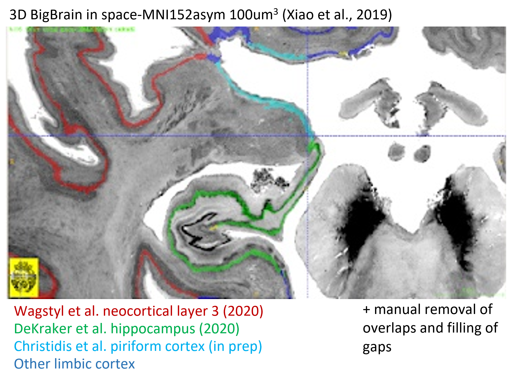
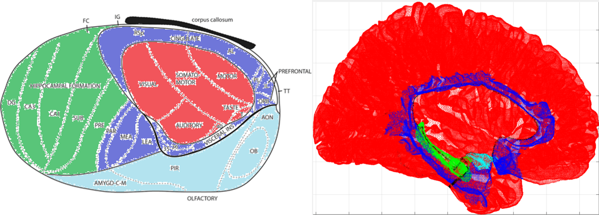
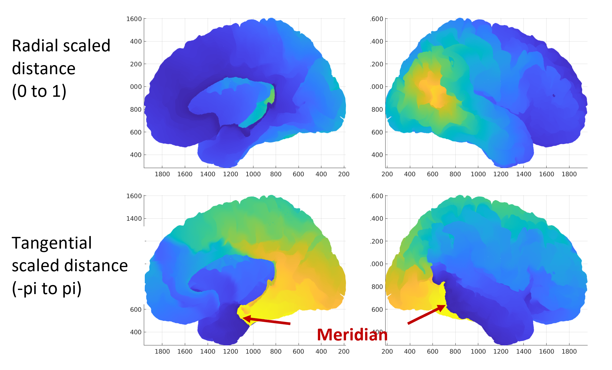

## Old Cortex

The goal of this project is to make a contiguous surface or label that encompasses the paleo-, archi-, and neo-cortex.

3D BigBrain (Amunts et al., 2013) is used to achieve all topological details (eg. small folds inside the hippocampus; full set of neocortical gyri):

Note that in addition to reducing these surfaces to a midthickness voxelized label, I also manually made changes including removing overlap between them and filling in some missing gaps.

### Biological motivation

In its ontogeny and phylogeny, the cortex developed in 3 stages (paleo-, archi-, and then neo-cortex). In the adult human brain, all three of these structures are still present and topologically contiguous:

Flat image adapted from (Puelles et al., 2019)

### Computational flatmapping

Here I used a Laplace coordinate framework (as in DeKraker et al., 2018). The Radial termini were the natural edges of the cortex (cingulate cortex and dentate gyrus) and the most geodisically distant point from that (which happened to fall at the visual-temporal-parietal junction). The Tangential termini were the two sides of the 'Meridian', which was defined as the shortest path along the Radial coordinates (and happened to fall approximately between archi- and paleo-cortex):

The Radial and Tangential coordinates were used as rho and theta, respectively, in a 2D polar mapping. Linear interpolation between 3D and 2D coordinates was used to generate the following visualization:

### NOTE

Currently `sourcedata/` and `.nii.gz` files are missing because they are too large to host on github. I will try and include them elsewhere.

## References

Amunts, K., Lepage, C., Borgeat, L., Mohlberg, H., Dickscheid, T., Rousseau, M. É., ... & Evans, A. C. (2013). BigBrain: an ultrahigh-resolution 3D human brain model. Science, 340(6139), 1472-1475.

DeKraker, J., Ferko, K. M., Lau, J. C., Köhler, S., & Khan, A. R. (2018). Unfolding the hippocampus: An intrinsic coordinate system for subfield segmentations and quantitative mapping. Neuroimage, 167, 408-418.

DeKraker, J., Lau, J. C., Ferko, K. M., Khan, A. R., & Köhler, S. (2020). Hippocampal subfields revealed through unfolding and unsupervised clustering of laminar and morphological features in 3D BigBrain. Neuroimage, 206, 116328.

Puelles, L., Alonso, A., García‐Calero, E., & Martínez‐de‐la‐Torre, M. (2019). Concentric ring topology of mammalian cortical sectors and relevance for patterning studies. Journal of Comparative Neurology, 527(10), 1731-1752.

Wagstyl, K., Larocque, S., Cucurull, G., Lepage, C., Cohen, J. P., Bludau, S., ... & Evans, A. C. (2020). BigBrain 3D atlas of cortical layers: cortical and laminar thickness gradients diverge in sensory and motor cortices. PLoS biology, 18(4), e3000678.

Xiao, Y., Lau, J. C., Anderson, T., DeKraker, J., Collins, D. L., Peters, T., & Khan, A. R. (2019). An accurate registration of the BigBrain dataset with the MNI PD25 and ICBM152 atlases. Scientific Data, 6(1), 1-9.

## TODO
- Generate a contiguous surface rather than point cloud
- Expand labels to span the full surface depth (instead of midlayer only)
- Left hemisphere
